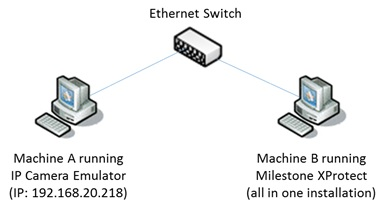
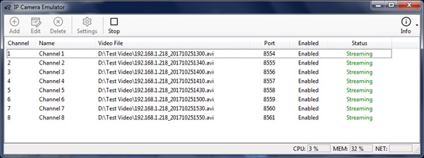
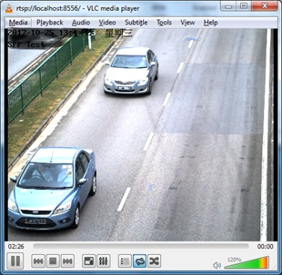
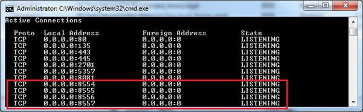

# IP Camera Emulator Std

Prebuilt Win32 binaries of IP Camera Emulator (Standard)

Note you will need to make a copy of the following files from the (32-bit) VLC application folder and place them in the same folder as the IpCameraEmulatorStd binaries,

- libvlc.dll
- libvlccore.dll
- the entire "plugins" folder

The ones from VLC version `2.2.6` and `1.1.9` seem to work well.
Get specific vlc version https://get.videolan.org/vlc/

The app requires .Net Framework 4 or higher, as well as the 32-bit runtime libraries for VC120 (try download and install vcredist_x86 from https://www.microsoft.com/en-sg/download/details.aspx?id=40784). App settings are maintained in C:\ProgramData\IpCameraEmulator\ and read/write access to this folder is required.

More details can be found at https://inspiredtechnologies.wordpress.com/2018/11/24/an-ip-camera-emulator/

**Add vlc library for ready to use @22Jan2020** Extract `vlc_dependencies.zip`

**A SIMPLE USE CASE**
In this simple use case illustration, the IP Camera Emulator was used to generate eight virtual H.264 camera streams for ingestion into Milestone XProtect VMS.

_IP Camera Emulator app running on Machine A_

Click the “Start” toolbar button to initiate the video stream emulation. The channel status should transit to “Streaming”.

At this point you should be able to connect to the RTSP streams either on the local machine or from a remote machine. The RTSP url of each channel takes on the following format:

      `rtsp://<IP address of machine>:<RTSPport>/`

For instance, in the above example and screenshot, `rtsp://localhost:8556/`, `rtsp://127.0.0.1:8556` or `rtsp://192.168.20.218:8556/` are valid RTSP urls of Channel 3, depending where you are connecting from. You can use VLC to connect to the RTSP streams.

“netstat -an” shows the expected ports in listening mode, ready for connection from RTSP clients.

**A NOTE ABOUT THE PREFERRED VIDEO CODEC TYPE**
The IP Camera Emulator app uses VLC libraries to generate the RTSP video streams without applying any transcoding, meaning the original video frames embedded in the video file are sent as-is. For this reason, H.264 video clips are generally more efficient candidates for video stream emulation in terms of network bandwidth utilization. Besides, the app consumes quite little CPU resources without the transcoding.

VLC provides a hint of the embedded video codec/format via the Tools > Codec Information dialog.
